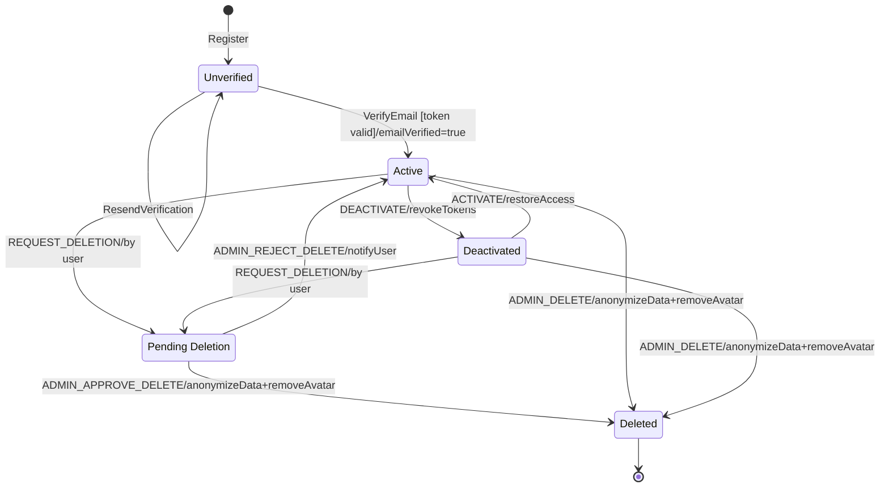
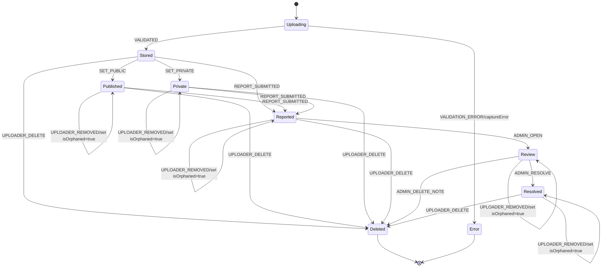
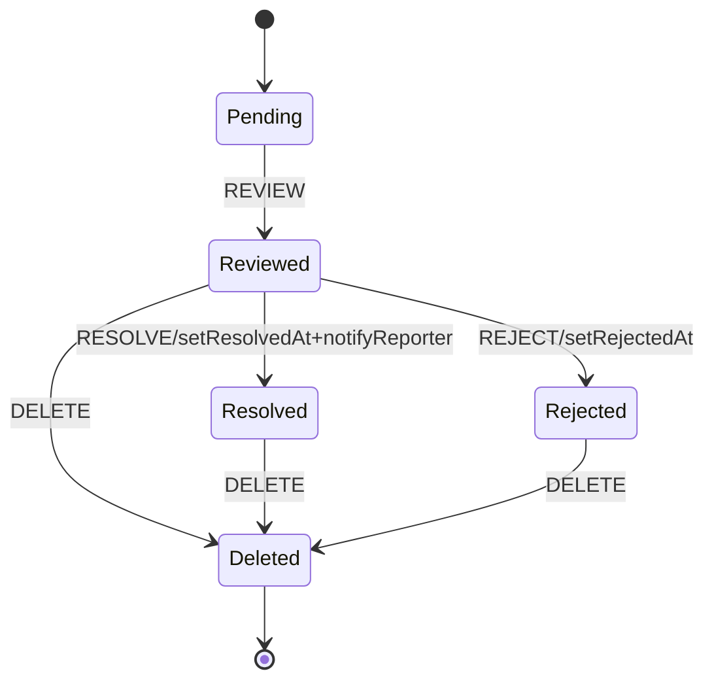

# Statecharts

This document captures the lifecycle statecharts for the three core domain objects in UniNotes: `User`, `Note`, and `Report`. Diagrams are expressed in Mermaid (`stateDiagram-v2`) so they can be rendered in VS Code, GitHub, and many Markdown viewers.

Notes on notation:
- Events are shown on transitions. Optional guards appear in square brackets, and actions after a slash.
- Start is `[*]` and terminal states are also `[*]` or explicit `final` states like `Deleted`.

## User

Key fields and drivers:
- `isActive:Boolean` — deactivation/activation toggles.
- `emailVerified:Boolean` — email verification gate on login.
- `pendingDeletion:{ status: 'pending'|'approved'|'rejected', requestedAt }` — self-service deletion workflow.

Operational notes:
- Registration creates an Unverified account; login requires `emailVerified = true`.
- Admins toggle `isActive` via Deactivate/Activate; this does not change verification history.
- Deletion can happen via approved user request or direct admin action; in both cases data cleanup is triggered.

## Note

Key fields and drivers:
- `visibility: 'public'|'private'`
- `reportsCount:Number`
- `isOrphaned:Boolean` — set when uploader account is removed (flag; does not change visibility).

Operational notes:
- "Uploading" covers the period between file submission and validation. On success, metadata is persisted in `Stored`, then visibility is chosen.
- Reporting a note routes it to admin review. Admin can resolve (keep or edit note) or delete it.
- `isOrphaned` is a flag set when the uploader account is deleted; it does not change the note's main lifecycle state.

## Report

Key fields and drivers:
- `status: 'pending'|'reviewed'|'resolved'|'rejected'`

Operational notes:
- Only `Reviewed` reports can transition to `Rejected` or `Resolved` (matching `reportService.updateStatus`).
- Deletion is allowed for any non-pending report; pending items remain in the queue until reviewed.

---

How to view: many Markdown previewers auto-render Mermaid. In VS Code, enable built-in preview or an extension that supports Mermaid to visualize these diagrams.
